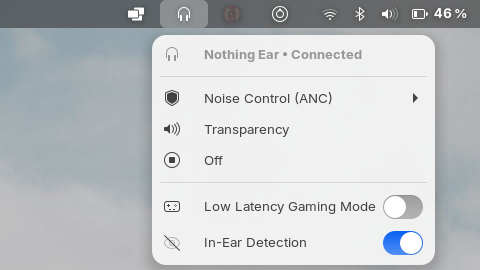
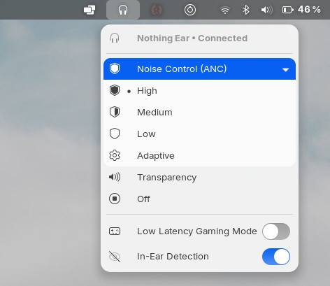

# 🎧 Nothing Ear Controller for Pop!_OS & GNOME

Native top-bar extension and lightweight controller for **Nothing Ear** and **CMF by Nothing** earbuds on **Pop!_OS** and **GNOME Shell**.

Provides seamless integration with Pop Shell / GNOME (official symbolic SVG icons, expandable sub-menus, native blue toggle switches, and instant RFCOMM Bluetooth command execution).

<p align="center">
  
  &nbsp;&nbsp;&nbsp;
  
</p>

---

## ✨ Features

* 🛡️ **Active Noise Cancellation (ANC) Control**:
  * High (*Élevée*)
  * Medium (*Moyenne*)
  * Low (*Faible*)
  * Adaptive (*Auto*)
* 🔊 **Transparency Mode** & **Off**
* 🎮 **Low Latency Gaming Mode** (native toggle switch without closing the menu)
* 👁️ **In-Ear Detection** (auto-pause toggle)
* 📂 **Expandable Submenu**: Clean Pop Shell fold-out menu that keeps the top bar uncluttered.
* ⚡ **Ultra Lightweight**: 0% background CPU usage, direct RFCOMM Bluetooth socket (~10ms execution).
* ⌨️ **Full CLI & Keyboard Shortcut Support**: Control ANC with a single keypress.

---

## 🚀 Installation

Clone or download this repository, then run the installer:

```bash
git clone https://github.com/<your-username>/nothing-ear-gnome.git
cd nothing-ear-gnome
./install.sh
```

### Reload GNOME Shell (Pop!_OS / X11)
1. Press **`Alt + F2`**
2. Type **`r`**
3. Press **`Enter`**

The headphone icon will immediately appear in your top bar!

---

## ⌨️ CLI Usage & Shortcuts

You can control your earbuds directly from the command line:

```bash
nothing-ear high          # Set ANC High
nothing-ear mid           # Set ANC Medium
nothing-ear low           # Set ANC Low
nothing-ear adaptive      # Set ANC Adaptive
nothing-ear transparency  # Set Transparency Mode
nothing-ear off           # Turn Noise Control Off
nothing-ear game-on       # Enable Low Latency Gaming Mode
nothing-ear game-off      # Disable Low Latency Gaming Mode
nothing-ear in-ear-on     # Enable In-Ear Detection
nothing-ear in-ear-off    # Disable In-Ear Detection
```

### Custom Keyboard Shortcuts
Go to **Settings ➔ Keyboard ➔ Custom Shortcuts**, and bind:
* `Ctrl + Shift + A` ➔ `nothing-ear high`
* `Ctrl + Shift + T` ➔ `nothing-ear transparency`

---

## 📡 Protocol & Architecture (RFCOMM Bluetooth)

Nothing earbuds communicate over standard Bluetooth RFCOMM (Channel `15`). Commands are sent directly to the device:

| Command | Payload (Hex) |
| :--- | :--- |
| **ANC High** | `5560010ff00300cf010100e66f` |
| **ANC Medium** | `5560010ff00300d5010200e69f` |
| **ANC Low** | `5560010ff00300d7010300e70f` |
| **ANC Adaptive** | `5560010ff00300dd010400e53f` |
| **Transparency** | `5560010ff00300cb010700c5af` |
| **Off** | `5560010ff00300cd010500c447` |
| **Low Latency ON** | `55600140f0020027010097f7` |
| **Low Latency OFF** | `55600140f00200280200a704` |
| **In-Ear ON** | `55600104f00300260101017310` |
| **In-Ear OFF** | `55600104f0030025010100b294` |

---

## 🎧 Device Compatibility

### 1. Nothing & CMF Lineup (100% Compatible)
* **Nothing**: Ear (1), Ear (2), Ear (3), Ear (a), Ear (stick), Ear (open)
* **CMF by Nothing**: CMF Buds, CMF Buds Pro, CMF Buds Pro 2, CMF Neckband Pro

### 2. Other Brands (Sony, Samsung, Apple, Google...)
Other manufacturers use different proprietary protocols (e.g. *Sony MDR*, *Samsung SPP*, *Apple GATT*). The codebase is modular, allowing new device handlers to be added in `bin/nothing-ear`.

---

## 📂 Project Structure

```text
nothing-ear-gnome/
├── bin/
│   └── nothing-ear                   # Standalone Python CLI & RFCOMM backend
├── desktop/
│   └── nothing-ear-control.desktop   # Desktop application launcher
├── extension/
│   ├── metadata.json                 # GNOME 42+ metadata
│   └── extension.js                  # Pop!_OS / GNOME Top Bar Extension
├── install.sh                        # 1-click installation script
├── uninstall.sh                      # Clean uninstallation script
├── LICENSE                           # GPL-3.0 License
└── README.md                         # Project documentation
```

---

## 🤝 Credits & Acknowledgements

* **Reverse Engineering & Protocol Research**:
  * [Bharadwaj Raju](https://bharadwaj-raju.github.io/posts/nothing-ear-2-on-linux/) for uncovering Nothing RFCOMM packet structures.
  * [Radiance Project (ear-web)](https://github.com/radiance-project/ear-web) for open-source community research.
  * [maniacx (BudsLink / Bluetooth Battery Meter)](https://github.com/maniacx/BudsLink) for Linux Bluetooth earbuds tools.
* **Development**:
  * Developed and crafted with AI pair-programming (Google DeepMind Antigravity).

---

## 📄 License

GPL-3.0 License.
